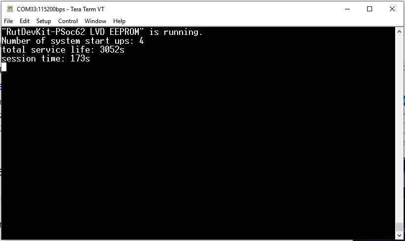
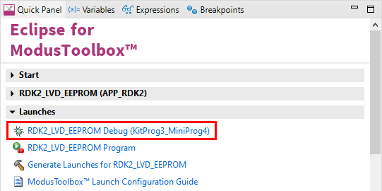

# RutDevKit-PSoC62_LVD_EEPROM

Rutronik Development Kit Programmable System-on-Chip CY8C6245AZI-S3D72 "LVD EEPROM" Application. 

This application is saving a 32bit value in emulated EEPROM.
The low voltage detector (LVD) generate an interrupt to save the  counter contend on shutdown. 

 

### Hardware customizations:

A capacitor must be added to the hardware to extend the time at shutdown from 3ms to 13ms. For this a 100µF type between 3.3V and GND is sufficient.

### Using the code example with a ModusToolbox IDE:

1. Import the project: **File** > **Import...** > **General** > **Existing Projects into Workspace** > **Next**.
2. Select the directory where **"RutDevKit-PSoC62_I2C_Scanner"** resides and click  **Finish**.
3. Select and build the project **Project ** > **Build Project**.

### Customization of RutDevKit-PSoC62:

### Operation

The application count the number of start-ups, save a timer counter value by lose of voltage.
On start-up, timer counter value and start-up count will be read back.  

### Debugging

If you successfully have imported the application, the debug configurations are already prepared to use with a the KitProg3, MiniProg4, or J-link. Open the ModusToolbox perspective and find the **Quick Panel**. Click on the desired debug launch configuration and wait until the programming completes and debug process starts.

## Legal Disclaimer

The evaluation board including the software is for testing purposes only and, because it has limited functions and limited resilience, is not suitable for permanent use under real conditions. If the evaluation board is nevertheless used under real conditions, this is done at one’s responsibility; any liability of Rutronik is insofar excluded. 

